<div align="center">

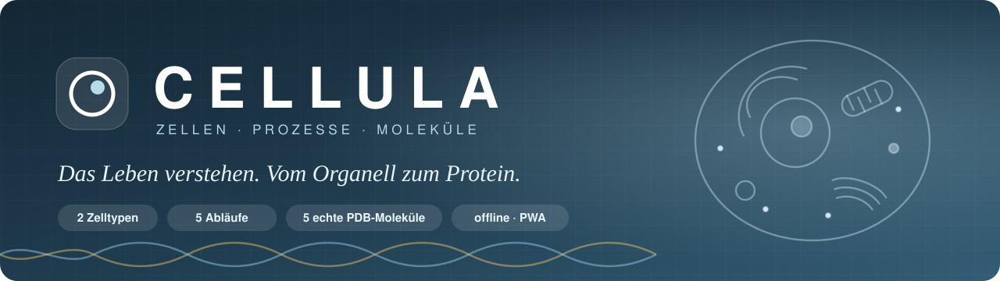

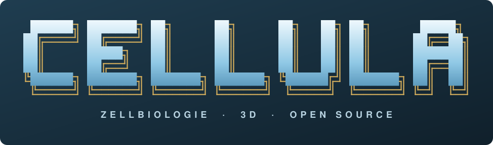

<details>
<summary>Originales ASCII-Logo zum Kopieren</summary>

```text
 ██████╗ ███████╗ ██╗      ██╗      ██╗   ██╗ ██╗       █████╗
██╔════╝ ██╔════╝ ██║      ██║      ██║   ██║ ██║      ██╔══██╗
██║      █████╗   ██║      ██║      ██║   ██║ ██║      ███████║
██║      ██╔══╝   ██║      ██║      ██║   ██║ ██║      ██╔══██║
╚██████╗ ███████╗ ███████╗ ███████╗ ╚██████╔╝ ███████╗ ██║  ██║
 ╚═════╝ ╚══════╝ ╚══════╝ ╚══════╝  ╚═════╝  ╚══════╝ ╚═╝  ╚═╝
       Z E L L B I O L O G I E  ·  3 D  ·  O P E N  S O U R C E
```

</details>

**Vom Inneren der Zelle bis zur Struktur eines Proteins.**<br>
Der interaktive Zellbiologie-Atlas für Schule, Studium und Lehre.<br>
**Auf Deutsch. Im Browser und als Desktop-App. Auch offline.**


<br>
[](https://github.com/dogenc/CELLULA/actions/workflows/atlas-quality.yml)


[**Entdecken**](#-drei-perspektiven-auf-das-leben) · [**3D-Studio**](#-das-3d-studio) · [**Screenshots**](#-screenshots) · [**Starten**](#-schnellstart) · [**Desktop**](#-desktop-apps) · [**Technik**](#-technik--qualitätsprüfung)

</div>

---

## 💡 Biologie wird räumlich

Eine Zelle aufklappen. Die Chromosomen während der Mitose verfolgen. Einen Antikörper drehen und seine Faltblätter erkennen. CELLULA verbindet räumliche Modelle mit verständlichen Erklärungen, sodass Aufbau und Funktion gemeinsam sichtbar werden.

Drei Bereiche führen vom Überblick ins Detail: **Zellen**, **Abläufe** und **Moleküle**. Jeder Bereich hat seine eigenen Werkzeuge; Suche, Notizen und Bildexport begleiten das Lernen.

Die Oberfläche gehört zur Atlas-Familie von [**CORPUS**](https://github.com/dogenc/CORPUS-Anatomieatlas): helle Panels, klare Typografie, ein großer Modellbereich und ruhige Studio-Beleuchtung. CELLULA widmet sich der Zellbiologie.

<table>
<tr>
<td align="center" width="33%">🎓<br><b>Lernen</b><br><sub>Organellen verstehen, Quiz üben, eigene Merksätze speichern</sub></td>
<td align="center" width="33%">👩‍🏫<br><b>Erklären</b><br><sub>Prozesse Schritt für Schritt zeigen und Bilder für Folien exportieren</sub></td>
<td align="center" width="33%">🧬<br><b>Entdecken</b><br><sub>Experimentelle PDB-Strukturen und ihre Untereinheiten erkunden</sub></td>
</tr>
</table>

---

## 🔬 Drei Perspektiven auf das Leben

### 01 · Zellen — den Aufbau verstehen

**Tier- und Pflanzenzelle** mit einzeln auswählbaren Organellen. Membran und Zellwand lassen sich aufklappen; die Explosionsansicht zieht die Bestandteile auseinander.

| Modell | Sichtbare Strukturen |
|---|---|
| **Tierzelle** | Zellmembran, Zellkern mit Kernporen und Chromatin, Kernkörperchen, raues und glattes ER, Golgi-Apparat, Vesikel, Mitochondrien mit gefalteten Cristae, Ribosomen, Lysosomen, Zentrosom und Zytoskelett |
| **Pflanzenzelle** | Zellkern, ER, Golgi-Apparat, Mitochondrien und Ribosomen; zusätzlich Zellwand, Plasmodesmen, Zentralvakuole und Chloroplasten mit Grana-Stapeln |

- **Auswählen, fokussieren, isolieren:** vom Zellüberblick direkt zum Organell.
- **Beschriftungen mit Verbindungslinien:** bis zu acht auf dem Desktop, vier auf dem Handy. Die Auswahl hat Vorrang; alle Organellen bleiben im Explorer erreichbar.
- **Quiz:** eine markierte Struktur benennen oder das gesuchte Organell im Modell finden. Der Leitner-Lernstand unterstützt Wiederholungen.
- **Wissen je Struktur:** Kerngedanke, Erklärung, Fachbegriff und Quellen.

### 02 · Abläufe — Veränderung beobachten

| Ablauf | Stationen |
|---|---|
| **Mitose** | Interphase → Prophase → Prometaphase → Metaphase → Anaphase → Telophase und Zytokinese |
| **Meiose** | Crossing-over in Prophase I, Trennung homologer Chromosomen, zweite Teilung und vier haploide Zellen |
| **DNA → RNA → Protein** | Transkription, RNA-Prozessierung, Kernexport, Initiation, Elongation, Termination und Faltung |
| **Zellatmung** | Glykolyse, oxidative Decarboxylierung, Citratzyklus, Atmungskette, ATP-Synthase und Bilanz |
| **Fotosynthese** | Lichtreaktion, Fotosystem II, Fotolyse, Elektronentransport, ATP-Synthase und Calvin-Zyklus |

Abspielen und pausieren, Schritte einzeln wählen, die Zeitleiste verschieben und das Tempo von **0,25× bis 2×** einstellen. Die Kamera kann dem Geschehen folgen; jeder Schritt erhält einen eigenen Erklärtext. Eine direkt gewählte Station zeigt einen repräsentativen Zeitpunkt und behält den aktuellen Abspiel- oder Pausenzustand bei.

### 03 · Moleküle — echte Strukturen erkunden

Die Koordinaten stammen aus der **Worldwide Protein Data Bank**. Die fünf enthaltenen Strukturen umfassen zusammen **52.832 Atome**, ohne Wasserstoff und Wasser.

| Molekül | PDB | Atome | Im Modell entdecken |
|---|:---:|---:|---|
| **DNA-Doppelhelix** | [1BNA](https://www.rcsb.org/structure/1BNA) | 486 | Zwei antiparallele Stränge und farbige Basen |
| **Hämoglobin** | [4HHB](https://www.rcsb.org/structure/4HHB) | 4.558 | Zwei α- und zwei β-Untereinheiten mit vier Häm-Gruppen |
| **Insulin** | [3I40](https://www.rcsb.org/structure/3I40) | 403 | A- und B-Kette; Schwefelatome in der Elementfärbung |
| **Antikörper** | [1IGT](https://www.rcsb.org/structure/1IGT) | 10.434 | Schwere und leichte Ketten, Zuckerketten und Faltblätter |
| **ATP-Synthase** | [6OQR](https://www.rcsb.org/structure/6OQR) | 36.951 | Untereinheiten, Stator und animierter Rotor aus c-Ring, γ und ε |

**Vier Ansichten:**

| Ansicht | Darstellung |
|---|---|
| **Cartoon** | Helixbänder, Faltblattpfeile und dünne Schleifen nach den Sekundärstrukturangaben des PDB-Eintrags. Standard für Proteine. |
| **Kalotten** | Atome mit Van-der-Waals-Radien und räumlicher Beleuchtung. |
| **Rückgrat** | Verlauf der Proteinkette bzw. des DNA-Rückgrats als Röhren. |
| **Kugel-Stab** | Atome und aus den Abständen abgeleitete Bindungen. |

Untereinheiten lassen sich hervorheben oder ausblenden. Atome zeigen bei Auswahl Element, Resttyp und Untereinheit. Färbung nach Untereinheit, Element, Polarität oder DNA-Base ist verfügbar; die Polaritätsfärbung betrifft Atome, das Rückgrat bleibt neutral.

---

## 🧭 Das 3D-Studio

| Werkzeug | Was es ermöglicht |
|---|---|
| **Kameraansichten** | Perspektive, vorne, oben und seitlich; automatische Anpassung an Modell und Fensterformat. |
| **Fokus** | Eine ausgewählte Zellstruktur vergrößern und anschließend zur Gesamtansicht zurückkehren. |
| **Schnittebene** | Längs-, Quer- und Frontalschnitt; Position stufenlos einstellen und die sichtbare Hälfte umkehren. Geschlossene Konturen erhalten Schnittflächen; vorhandene Öffnungen bleiben erhalten. |
| **Studio-Hintergrund** | Heller oder dunkler Modellbereich mit drei Lichtquellen und ACES-Tonemapping. |
| **Grafikqualität** | Automatisch, Sparsam oder Hoch. Die Automatik passt die Renderauflösung an die gemessene Bildrate an; die Modellgeometrie bleibt vollständig. |
| **Touch-Bedienung** | Drehen, zoomen und verschieben; ausklappbarer Explorer und weniger Beschriftungen auf kleinen Displays. |

### Lernen, teilen und mitnehmen

- **Notizen** zu einzelnen Einträgen werden auf dem eigenen Gerät gespeichert.
- **Direktlinks** öffnen ein Molekül, eine Zelle oder einen Prozessschritt, zum Beispiel `#ablauf/meiose/2`.
- **PNG-Export** für Folien; zusätzlich ein **4:5-Hochformat** mit Titel und Quellenangabe.
- **Offline speichern** lädt Oberfläche und alle fünf Molekülpakete für spätere Nutzung ohne Verbindung.
- **Kein Konto, kein Tracking:** Notizen und Lernstand bleiben lokal. Für Quellenlinks ist eine Verbindung erforderlich.

### Tastenkürzel

| Taste | Aktion | Taste | Aktion |
|:---:|---|:---:|---|
| <kbd>1</kbd> <kbd>2</kbd> <kbd>3</kbd> | Zellen · Abläufe · Moleküle | <kbd>Leertaste</kbd> | Ablauf abspielen / pausieren |
| <kbd>/</kbd> | Suche | <kbd>←</kbd> <kbd>→</kbd> | Schritt zurück / vor |
| <kbd>L</kbd> | Beschriftungen | <kbd>Q</kbd> | Quiz |
| <kbd>B</kbd> | PNG speichern | <kbd>R</kbd> | Ansicht zurücksetzen |

---

## 📸 Screenshots

Zehn neue, echte Screenshots aus der laufenden Anwendung — aufgenommen mit hoher Grafikqualität in **1800 × 1100 Pixeln**. Die mobile Ansicht wird separat aufgenommen. [Alle Bilder in voller Auflösung ansehen](docs/screenshots/gallery/).

<a href="docs/screenshots/gallery/02-studio.webp">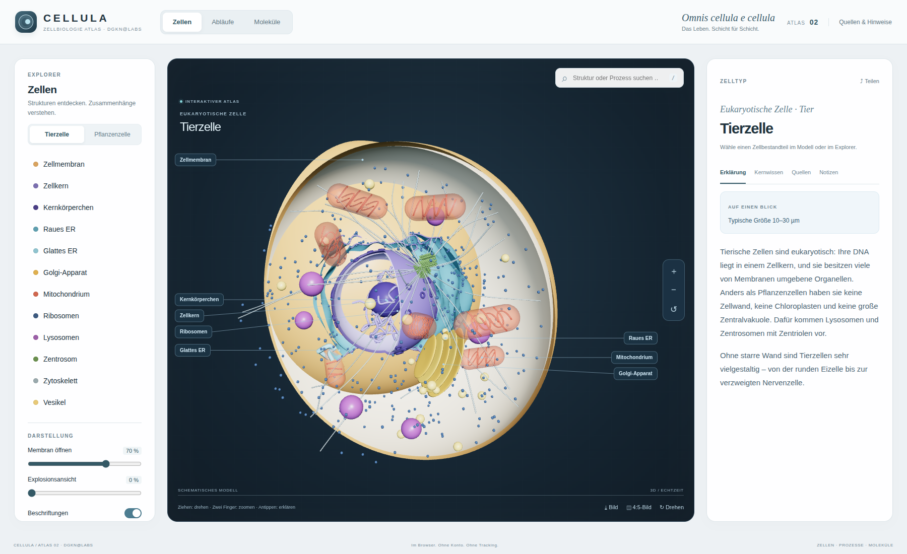</a>

<table>
<tr>
<td width="50%"><a href="docs/screenshots/gallery/01-zellatlas.webp">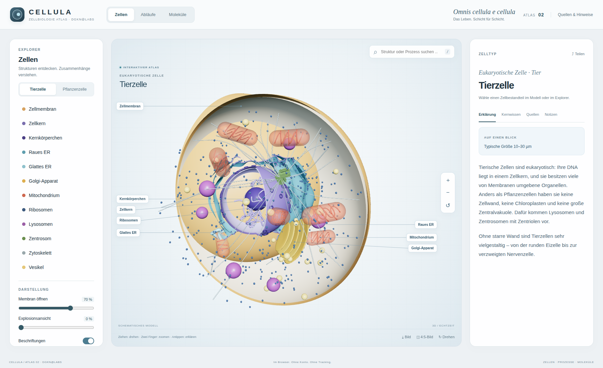</a><br><sub><b>Zell-Atlas</b> · Tierzelle, Organellen und Lerntext</sub></td>
<td width="50%"><a href="docs/screenshots/gallery/04-pflanzenzelle.webp">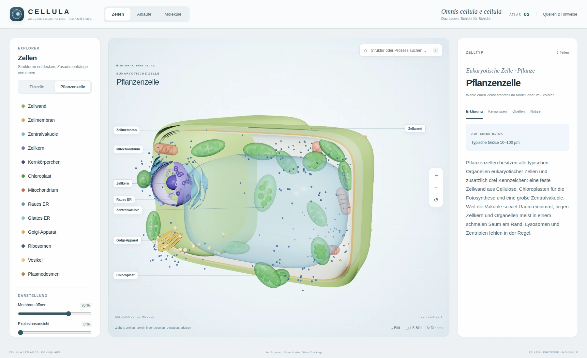</a><br><sub><b>Pflanzenzelle</b> · Zellwand, Vakuole und Chloroplasten</sub></td>
</tr>
<tr>
<td width="50%"><a href="docs/screenshots/gallery/03-zellkern.webp">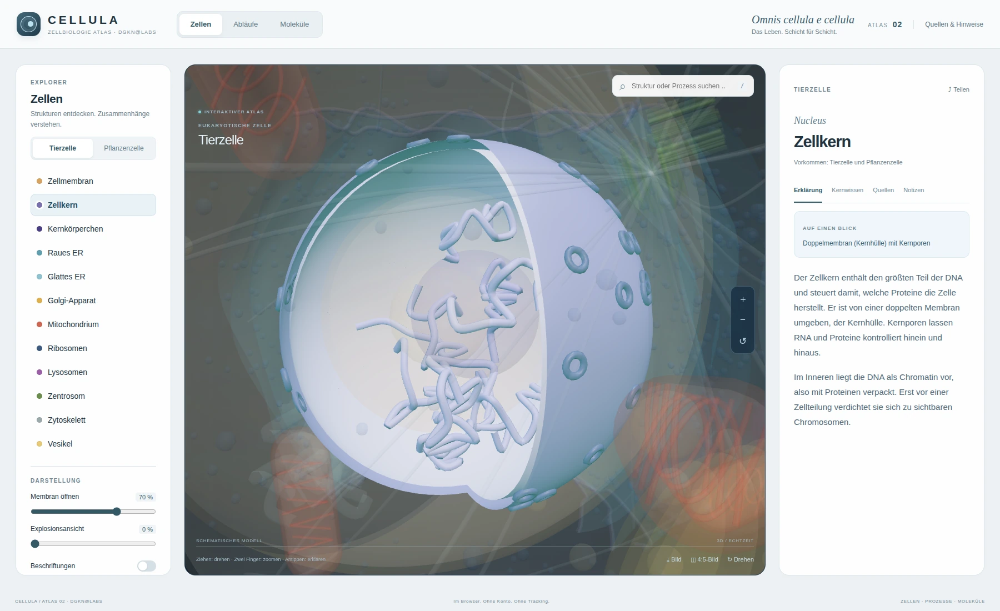</a><br><sub><b>Zellkern im Fokus</b> · Kernhülle, Poren und Chromatin</sub></td>
<td width="50%"><a href="docs/screenshots/gallery/07-dna.webp">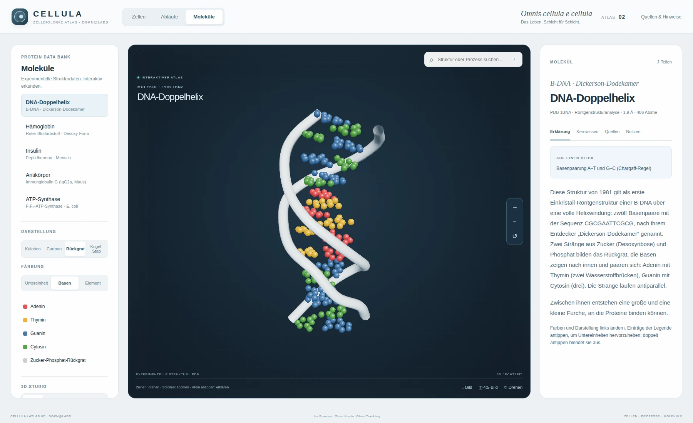</a><br><sub><b>DNA-Doppelhelix</b> · Basen und Zucker-Phosphat-Rückgrat</sub></td>
</tr>
<tr>
<td width="50%"><a href="docs/screenshots/gallery/05-antikoerper.webp">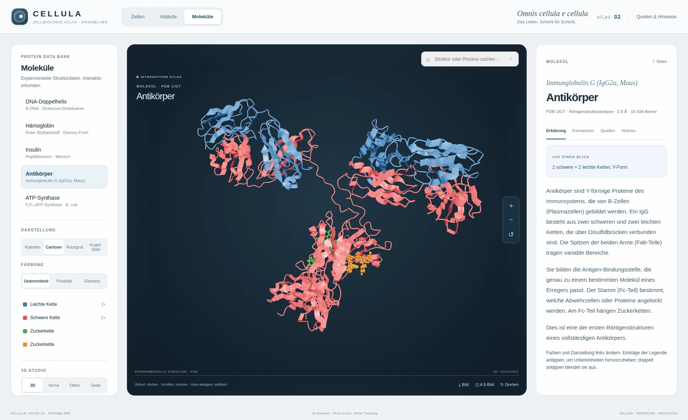</a><br><sub><b>Antikörper</b> · Faltblattpfeile und Untereinheiten</sub></td>
<td width="50%"><a href="docs/screenshots/gallery/06-atp-synthase.webp">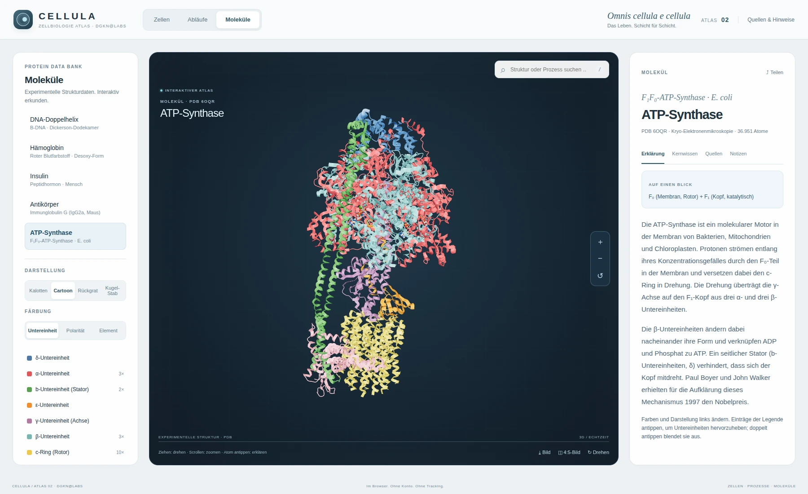</a><br><sub><b>ATP-Synthase</b> · Katalytischer Kopf, Achse und Rotor</sub></td>
</tr>
<tr>
<td width="50%"><a href="docs/screenshots/gallery/08-meiose.webp">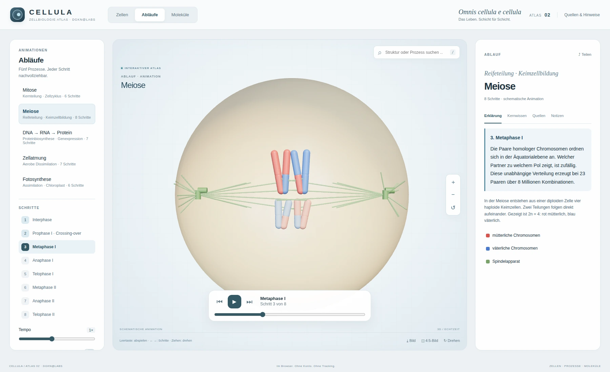</a><br><sub><b>Meiose</b> · Chromosomen und Spindelapparat</sub></td>
<td width="50%"><a href="docs/screenshots/gallery/10-fotosynthese.webp">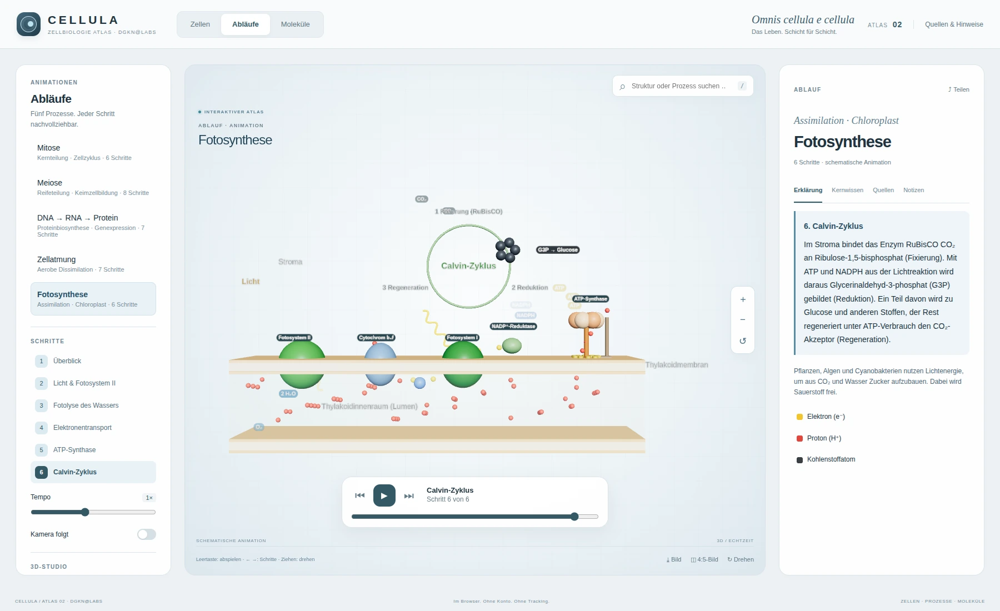</a><br><sub><b>Fotosynthese</b> · Lichtreaktion und Calvin-Zyklus</sub></td>
</tr>
</table>

<div align="center">
<a href="docs/screenshots/gallery/11-mobil.webp">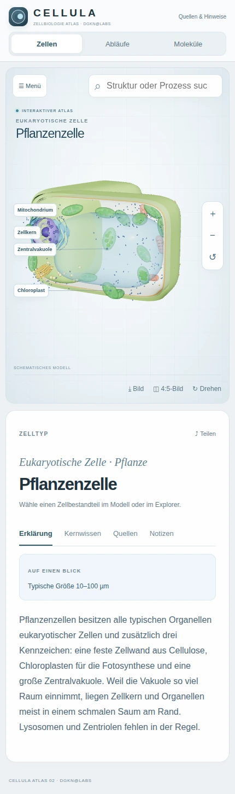</a><br>
<sub><b>Mobil</b> · Pflanzenzelle und Lerntext bei 430 Pixel Displaybreite</sub>
</div>

---

## 🚀 Schnellstart

Für die Browserversion genügt **Python 3**. Alle Modell- und Bibliotheksdateien sind enthalten.

```bash
git clone https://github.com/dogenc/CELLULA.git
cd CELLULA
python3 start.py
```

Die Anwendung öffnet sich unter **http://127.0.0.1:8766**. Beenden mit <kbd>Strg</kbd> + <kbd>C</kbd>.

**Windows:** Doppelklick auf [`START_WINDOWS.cmd`](START_WINDOWS.cmd). Die Anleitung steht in [`START_HIER.txt`](START_HIER.txt).

> [!NOTE]
> Die `index.html` über den lokalen Server öffnen. ES-Module und Moleküldaten benötigen HTTP statt eines direkten Datei-Doppelklicks.

## 🖥️ Desktop-Apps

Die Electron-App liefert Oberfläche, 3D-Bibliothek und Moleküldaten lokal mit. Für ihre Nutzung sind weder Python noch ein eigener Webserver erforderlich.

| Plattform | Paketformat |
|---|---|
| **Windows** | Setup-Installer `.exe` und portable `.exe` |
| **macOS** | `.dmg` für Intel und Apple Silicon |

**[Veröffentlichte Downloads ansehen →](https://github.com/dogenc/CELLULA/releases)**

Der Quellstand **2.1.0** und veröffentlichte Installer haben getrennte Versionsstände. Die Versionsnummer des jeweiligen Releases gibt an, welche Änderungen das Paket enthält.

Der [Desktop-Workflow](.github/workflows/desktop.yml) führt zuerst die vollständigen Atlas- und Windows-Prüfungen aus. Erst nach erfolgreicher Prüfung werden die Installer gebaut. Er startet per Versions-Tag oder manuell über GitHub Actions.

Für die lokale Entwicklung:

```bash
cd desktop
npm ci
npm start
```

Eigene Pakete lassen sich anschließend mit `npm run dist:win` auf Windows bzw. `npm run dist:mac` auf macOS erzeugen. Informationen zu Betriebssystemhinweisen und Veröffentlichung stehen im jeweiligen Release.

---

## 🛠️ Technik & Qualitätsprüfung

**Vanilla JavaScript, ES-Module und Three.js.** Die Website braucht keinen Bundler und keinen Kompilierungsschritt. Der Ordner `dist/` enthält die auslieferbare Anwendung.

Atomkugeln werden im Shader mit korrekter Oberflächentiefe und Schnittfläche berechnet. Proteincartoons entstehen aus Rückgratkoordinaten und den Helix-/Faltblattangaben der mmCIF-Dateien. Die Zellmodelle werden direkt im Browser erzeugt.

| Bereich | Dateien |
|---|---|
| Oberfläche und Bedienung | `dist/index.html`, `style.css`, `app.js` |
| Zellmodelle | `dist/cells.js` |
| Biologische Abläufe | `dist/division.js`, `synthesis.js`, `energy.js` |
| Moleküle und Cartoon-Geometrie | `dist/molecules.js`, `cartoon.js`, `assets/` |
| Schnittflächen und Beschriftungen | `dist/sections.js`, `layout.js` |
| Lerntexte und Quellen | `dist/knowledge.js` |
| Offline-Web-App | `dist/sw.js`, `manifest.webmanifest` |
| Desktop-App | `desktop/` |
| Datenaufbereitung | `scripts/prepare_molecules.mjs` |
| Automatische Prüfungen | `tests/`, `.github/workflows/atlas-quality.yml` |

### Was vor dem Paketbau geprüft wird

- Endliche Koordinaten und Transformationen aller Zell-, Prozess- und Molekülmodelle.
- Sekundärstrukturzuordnungen, Helixbänder und Faltblattpfeile.
- Geschlossene Schnittflächen, erhaltene Aussparungen und Freigabe alter Geometrie.
- Desktop- und Handy-Bedienung, Beschriftungen, Darstellungsmodi und Grafikstufen.
- Quiz, Notizen, Bildexport und Laden aller Moleküle nach Offline-Neuladen.
- **Windows:** Start über `cellula://app`, lokale Moleküldaten, persistente Notizen und PNG-Export.

Die [Actions-Ergebnisse](https://github.com/dogenc/CELLULA/actions/workflows/atlas-quality.yml) dokumentieren den geprüften Commit. Screenshots werden bei jedem Testlauf als Artefakte gespeichert.

**Prüfstand 2.1.0:** [Browser- und Windows-Prüfungen erfolgreich](https://github.com/dogenc/CELLULA/actions/runs/37110230100). Die Installer stehen im [Release v2.1.0](https://github.com/dogenc/CELLULA/releases/tag/v2.1.0).

Lokale Modellprüfung mit Node.js 22+:

```bash
npm install --no-save --package-lock=false @napi-rs/canvas@0.1.80
node --experimental-loader ./tests/three-loader.mjs tests/models.mjs
```

PDB-Daten samt Sekundärstrukturangaben neu erzeugen:

```bash
node scripts/prepare_molecules.mjs
```

### Statisch hosten

`dist/` als Website-Wurzel veröffentlichen, etwa über Cloudflare Pages oder einen eigenen Webserver. **Kein Build-Befehl**, Ausgabeverzeichnis **`dist`**. Offline-Web-App und Service Worker benötigen **HTTPS** oder `localhost`. Sicherheits- und Cache-Header stehen in [`dist/_headers`](dist/_headers).

Die Browserversion benötigt WebGL2, Importmaps und `DecompressionStream`. Die automatischen Oberflächenprüfungen laufen in Chromium; die Windows-App wird separat mit Electron geprüft.

---

## 🤝 Mitmachen

Beiträge aus Biologie, Biochemie, Gestaltung und Lehre sind willkommen: fachliche Prüfung der Texte, zusätzliche Moleküle, neue Abläufe, Barrierefreiheit oder weitere Sprachen.

[**Issue eröffnen**](https://github.com/dogenc/CELLULA/issues) oder einen Pull Request stellen. Fachliche Änderungen bitte mit Quellen belegen; übernommenes Material muss eine passende Lizenz besitzen.

## 📜 Quellen & Lizenz

| Bestandteil | Herkunft | Lizenz |
|---|---|---|
| **Code, Zellmodelle und Animationen** | CELLULA | [MIT](LICENSE) |
| **Erklärtexte** | Zusammenfassungen auf Grundlage von OpenStax *Biology 2e*, Clark, Douglas und Choi, Rice University | Grundlage [CC BY 4.0](https://creativecommons.org/licenses/by/4.0/); Namensnennung erhalten |
| **Molekülkoordinaten und Strukturangaben** | wwPDB über RCSB PDB | [CC0 1.0](https://creativecommons.org/publicdomain/zero/1.0/) |
| **Three.js 0.180.0** | Three.js contributors | MIT; [`dist/vendor/LICENSE`](dist/vendor/LICENSE) |

Originalpublikationen, Änderungen an den Daten und Drittkomponenten: [**NOTICE.md**](NOTICE.md). Zweckbestimmung, Haftung und Datenschutz: [**RECHTLICHES.md**](RECHTLICHES.md).

### Darstellung bewusst einordnen

Zellmodelle und Animationen zeigen biologische Prinzipien schematisch; Größe, Anzahl und Packungsdichte der Organellen sind vereinfacht. PDB-Modelle sind experimentelle Strukturen mit begrenzter Auflösung. Fehlende Rückgratabschnitte werden nicht überbrückt; die Cartoonansicht der DNA bleibt eine Rückgratdarstellung. Der animierte ATP-Synthase-Rotor veranschaulicht Rotation und bildet keinen vollständigen katalytischen Zyklus ab.

Die Texte sind KI-unterstützt erstellt und nicht redaktionell abgenommen. CELLULA dient der Bildung.

<div align="center">
<br>


**Große Zusammenhänge beginnen in kleinen Zellen.**<br>
<sub>CELLULA · DGKN@Labs · Atlas 02</sub><br>
<sub>[CORPUS · Der Körper](https://github.com/dogenc/CORPUS-Anatomieatlas) &nbsp; / &nbsp; <b>CELLULA · Die Zelle</b> &nbsp; / &nbsp; [TERRA · Die Erde](https://github.com/dogenc/TERRA) &nbsp; / &nbsp; [ELEMENTA · Die Materie](https://github.com/dogenc/ELEMENTA)</sub>

</div>
